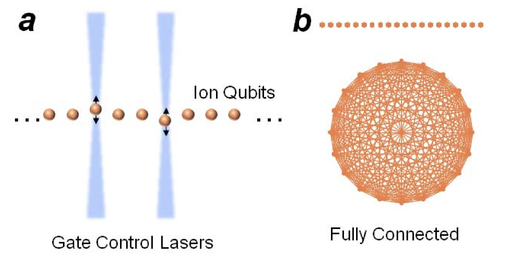
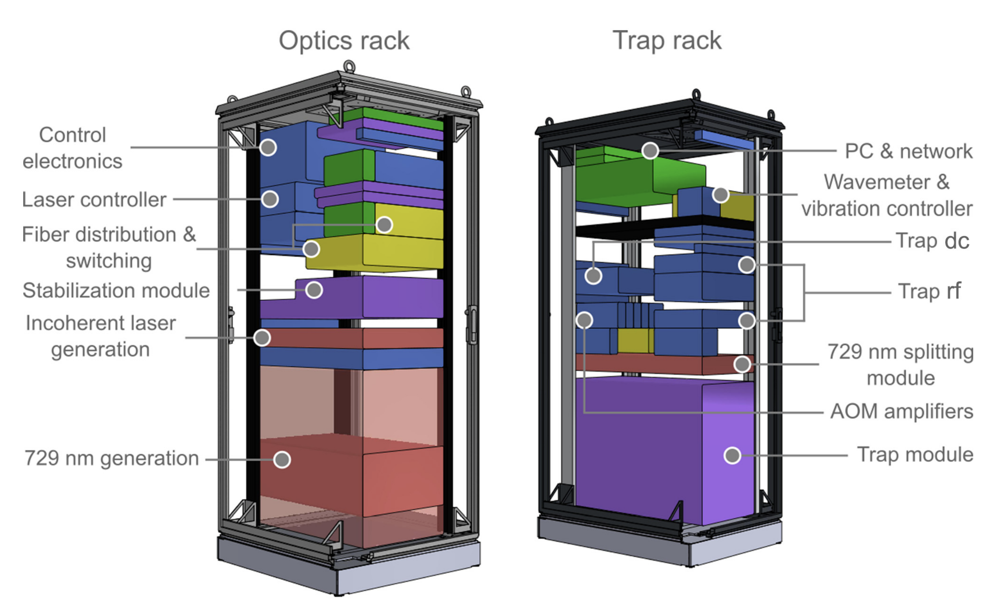

# Open Quantum Design
Computers are composed of many layers. At the lowest level are transistors and bits, which represent and process the information. 

## Quantum computers
Quantum computers utilize the effects of quantum mechanics to process information. 
Some of the most important effects of quantum mechanics for computing purposes are superposition, entanglement, and measurement.

* **Superposition**: When a quantum particle can be in two distinct states, e.g., spin-up or spin-up, it can also exist in a superposition of those two states -- the particles 
* **Entanglement**: When two or more quantum particles *interact* with one another, they can become entangled. Entanglement can be seen as two (or more) particles that 
* **Measurement**:

While classical computers are based on *bits*, information stored as 0 and 1's, quantum computers are based on *qubits*. 

Quantum computers can be created using a variety of different underlying quantum systems. 
Some of the most popular directions that are being pursued include:
* **Atoms/ions**: Isolating individual atoms or ions. These are generally referred to as *trapped ion* or *neutral atom* quantum computers, respectively. These approaches differ in the methods for isolating and controlling the atoms. 
* **Photons**: Individual particles, or quanta, of light can be used as the basic building blocks of a quantum computer. 
* **Superconducting circuits**:
* **Spins**

### Digital vs. analog quantum computing

## Ion trap quantum computers
* Ions can remain in a quantum superposition for long times, allowing longer computations to be performed without error.
* Preparing and measuring the ions can be done to a very high degree of fidelity.
* Trapped ion quantum devices can be made to have *all-to-all* connectivity. Other architectures are limited in which qubits can interact with which other qubits, often due to the physical layout of the device. Trapped ions can overcome this limitation, as the ions can be made to move, or 'shake', coupled with other ions in very controlled ways. 

Layers of trapped ion quantum computer include:
* Vacuum chamber to trap ions
* Radiofrequency probes to provide the trapping potential
* 
* Laser system to control ions in the trap, including addressing the ions individually
* Timing electronics 

## Controlling a trapped ion quantum computer

## Real-time control
Trapped ions are addressed through optical laser pulses that address atomic transitions of the ions.
A set of tunable laser beams pass through the ion trap such that they are incident on the ions.
The intensity, polarization, and frequency of each of these beams is finely controlled in real-time (with μs resolution).

### Pulse languages

### Digital circuit languages
Abstracting away from the leve of optical and electronic pulses, 
Quantum computers can be programmed at various levels of abstraction -- much like classical computers that range from machine code to high-level interpreted languages like Python.

### Analog circuit languages

## Applications

### Analog quantum simulations
Simulating a quantum system is important in many domains of physics and chemistry.
Use cases range from developing better battery materials, 

### Digital algorithms
* Factoring algorithms
* Unstructured database search
* 

### 

## Survey of the commercial landscape field
* **Trapped ion**: Quantinuum, IonQ, Alpine Quantum Technologies, 
* **Neutral atoms**: Pasqal, Quera,
* **Superconducting circuits**: Google Quantum AI, IBM Quantum, Rigetti, DWave, Diraq
* **Photons**: Xanadu, Quandela, 
* **Others**: Photonic Inc., 

## Open source quantum technologies
A variety of open source projects have emerged with quantum technologies. [4]

### Open software

### Open hardware

### User test facilities

## References
* [1] Maslov, D., Nam, Y. & Kim, J. An Outlook for Quantum Computing [Point of View]. Proc. IEEE 107, 5–10 (2019).
* [2] Pogorelov, I. et al. Compact Ion-Trap Quantum Computing Demonstrator. PRX Quantum 2, 020343 (2021).
* [3] Blatt, R. & Wineland, D. Entangled states of trapped atomic ions. Nature 453, 1008–1015 (2008).
* [4] Shammah, N. et al. Open Hardware in Quantum Technology. Preprint at https://doi.org/10.48550/arXiv.2309.17233 (2023).

