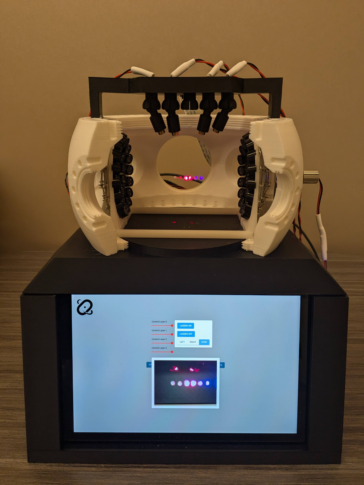

# 

<h2 align="center">
    Open Quantum Design: Full-stack Trapped-ion Demo  
</h2>

## About
What is a trapped ion quantum computer? 
What are the components that go into building a trapped ion quantum computer?
What does it mean to "trap" an ion?

As quantum computers become increasingly widespread in the world, and as their capabilities advance,
teaching an intuitive sense of how these machines work, what they are composed of, and how to interact with them
is an important mission. At Open Quantum Design, we aim to democratize the access to quantum computing technologies,
and accelerate a quantum-ready workforce and global community.

## Motivation
We want to provide a tactile and interactive activity for learning about, programming, and building quantum computers
This project contains the designs for "trapped-ion quantum computer", using low-cost, easily accessible electronics.

## What's inside
The demo traps small beads of polystyrene in an acoustic trap, 
in analogy to ions in an electromagnetic trap, except visible to the naked eye and can be interacted with. 
Inexpensive diode lasers are added to demonstrate how the ions are manipulated using light.
To demonstrate how the real trapped-ion system is measured using photodetectors, a camera module is included.
A Raspberry Pi and Arduino Nano control all of these elements, and a touchscreen display provides a user interface.
The enclosure is 3D printed and components assembled.

## How to build your own
The designs, including object files to 3D print, electronic wiring diagrams, and the control software are all included in this repository.
Note that v3 is in the works, which will include improved 

# 
In the picture of the v2 design of the demo unit, six polystyrene balls are suspended in midair by sound.
The pressure waves formed by an array of transducers at each end create nodal points - 
points where objects are suspended in-place by the force of the air pressure. 
Red and blue lasers, shining onto the "ions", demonstrate how the state of the quantum computer is manipulated and
how algorithms are performed by a tightly orchestrated sequence of light pulses.
